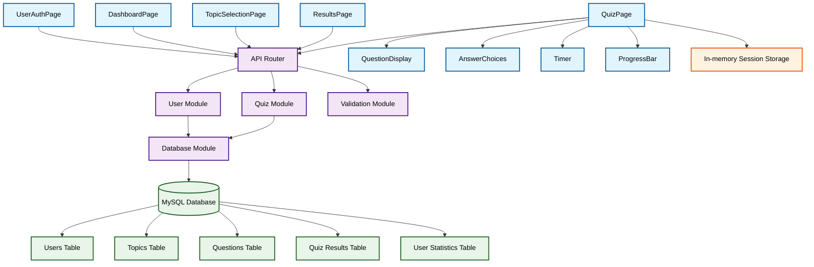

# System Components Architecture

## Overview
This document defines the system components for the quiz application, their responsibilities, and dependencies based on the confirmed architecture decisions.

## Architecture Summary
- **Frontend**: ReactJS (organized by pages)
- **Backend**: Python (single application with modules)
- **Database**: MySQL
- **Session Management**: Session cookies
- **API**: REST

## Frontend Components (ReactJS)

### 1. User Authentication Page
**Component**: `UserAuthPage`
**Responsibility**: Handle user ID entry and validation
**Features**:
- User ID input form
- Client-side format validation (alphanumeric)
- Error message display for duplicate IDs
- Session cookie management

**Dependencies**:
- Backend User Module (API calls)
- React Router for navigation

### 2. Dashboard Page
**Component**: `DashboardPage`
**Responsibility**: Display user performance metrics and quiz initiation
**Features**:
- Recent quiz scores display (last 5)
- Average score calculation display
- Topic-wise performance statistics
- Average response time metrics
- Start New Quiz button

**Dependencies**:
- Backend User Module (statistics API)
- Backend Quiz Module (topic list API)
- React Router for navigation

### 3. Topic Selection Page
**Component**: `TopicSelectionPage`
**Responsibility**: Allow users to select quiz topics
**Features**:
- Display available topics (General Knowledge, Science, Films)
- Topic selection interface
- Navigation to quiz page

**Dependencies**:
- Backend Quiz Module (topics API)
- React Router for navigation

### 4. Quiz Taking Page
**Component**: `QuizPage`
**Responsibility**: Handle quiz session and question display
**Features**:
- Question display (one at a time)
- Answer choice selection (4 options)
- Client-side 20-second timer
- Progress indicator (question X of 10)
- Forward-only navigation
- Answer submission

**Sub-components**:
- `QuestionDisplay`: Renders question text
- `AnswerChoices`: Renders 4 randomized answer options
- `Timer`: Client-side countdown timer
- `ProgressBar`: Shows quiz progress

**Dependencies**:
- Backend Quiz Module (questions API, answer submission API)
- In-memory session storage for quiz state

### 5. Results Page
**Component**: `ResultsPage`
**Responsibility**: Display quiz results and correct answers
**Features**:
- Final score display
- Correct answer review
- Question-by-question breakdown
- Navigation back to dashboard

**Dependencies**:
- Backend Quiz Module (results API)
- React Router for navigation

### 6. Error Handling Components
**Component**: `ErrorBoundary`, `NetworkError`
**Responsibility**: Handle application errors gracefully
**Features**:
- Network connection error display
- Duplicate user ID error handling
- General error boundary for React components

## Backend Components (Python)

### 1. User Management Module
**Module**: `user_module.py`
**Responsibility**: Handle user ID validation and session management
**Features**:
- User ID uniqueness validation
- Session cookie creation and validation
- User statistics calculation
- User data persistence

**Functions**:
- `validate_user_id(user_id)`: Check ID format and uniqueness
- `create_session(user_id)`: Create session cookie
- `get_user_statistics(user_id)`: Retrieve user performance data
- `calculate_averages(user_id)`: Calculate average scores and response times

**Dependencies**:
- Database Module (user data access)
- Session Management utilities

### 2. Quiz Management Module
**Module**: `quiz_module.py`
**Responsibility**: Handle quiz logic, questions, and scoring
**Features**:
- Topic management
- Random question selection (application-level)
- Answer validation
- Score calculation
- Quiz result storage

**Functions**:
- `get_topics()`: Retrieve available quiz topics
- `get_random_questions(topic, count=10)`: Select random questions
- `validate_answer(question_id, selected_answer)`: Validate user answer
- `calculate_score(answers)`: Calculate final quiz score
- `save_quiz_result(user_id, quiz_data)`: Store quiz results

**Dependencies**:
- Database Module (question bank access)
- Random selection algorithms

### 3. Database Module
**Module**: `database_module.py`
**Responsibility**: Handle all database operations
**Features**:
- Database connection management
- CRUD operations for all entities
- Query optimization
- Transaction management

**Functions**:
- `get_user_by_id(user_id)`: Retrieve user data
- `save_user_result(user_id, result)`: Store quiz result
- `get_questions_by_topic(topic)`: Retrieve questions for topic
- `get_user_statistics(user_id)`: Get user performance data

**Dependencies**:
- MySQL database
- Database connection pool

### 4. API Router Module
**Module**: `api_router.py`
**Responsibility**: Handle HTTP routing and request/response processing
**Features**:
- REST endpoint definitions
- Request validation
- Response formatting
- Error handling
- Session management

**Endpoints**:
- User authentication and validation
- Dashboard data retrieval
- Quiz topic and question APIs
- Result submission and retrieval

**Dependencies**:
- User Module
- Quiz Module
- Session management utilities

### 5. Validation Module
**Module**: `validation_module.py`
**Responsibility**: Input validation and security
**Features**:
- XSS prevention
- SQL injection protection
- Input sanitization
- Data format validation

**Functions**:
- `sanitize_user_input(input_data)`: Clean user input
- `validate_user_id_format(user_id)`: Validate ID format
- `validate_quiz_response(response)`: Validate answer selection

## Database Components (MySQL)

### 1. Users Table
**Purpose**: Store user information and session data
**Fields**:
- `user_id` (VARCHAR, PRIMARY KEY): Unique user identifier
- `created_at` (TIMESTAMP): Account creation time
- `last_active` (TIMESTAMP): Last activity timestamp

### 2. Topics Table
**Purpose**: Store quiz topics
**Fields**:
- `topic_id` (INT, PRIMARY KEY, AUTO_INCREMENT)
- `topic_name` (VARCHAR): Topic name (General Knowledge, Science, Films)
- `description` (TEXT): Topic description

### 3. Questions Table
**Purpose**: Store quiz questions and answers
**Fields**:
- `question_id` (INT, PRIMARY KEY, AUTO_INCREMENT)
- `topic_id` (INT, FOREIGN KEY): Reference to topics table
- `question_text` (TEXT): Question content
- `option_a` (VARCHAR): First answer option
- `option_b` (VARCHAR): Second answer option
- `option_c` (VARCHAR): Third answer option
- `option_d` (VARCHAR): Fourth answer option
- `correct_answer` (CHAR): Correct answer (A, B, C, or D)

### 4. Quiz Results Table
**Purpose**: Store quiz results and scores
**Fields**:
- `result_id` (INT, PRIMARY KEY, AUTO_INCREMENT)
- `user_id` (VARCHAR, FOREIGN KEY): Reference to users table
- `topic_id` (INT, FOREIGN KEY): Reference to topics table
- `score` (INT): Quiz score (0-10)
- `total_questions` (INT): Total questions (always 10)
- `completion_time` (TIMESTAMP): Quiz completion time
- `average_response_time` (DECIMAL): Average time per question

### 5. User Statistics Table
**Purpose**: Store aggregated user performance data
**Fields**:
- `user_id` (VARCHAR, PRIMARY KEY, FOREIGN KEY)
- `total_quizzes` (INT): Total quizzes taken
- `average_score` (DECIMAL): Overall average score
- `average_response_time` (DECIMAL): Overall average response time
- `last_updated` (TIMESTAMP): Last statistics update

## Component Dependencies

### Frontend Dependencies
```
UserAuthPage → Backend User Module
DashboardPage → Backend User Module, Quiz Module
TopicSelectionPage → Backend Quiz Module
QuizPage → Backend Quiz Module, In-memory storage
ResultsPage → Backend Quiz Module
```

### Backend Dependencies
```
API Router → User Module, Quiz Module, Validation Module
User Module → Database Module
Quiz Module → Database Module
Database Module → MySQL Database
Validation Module → (No dependencies)
```

### Data Flow
```
Frontend Pages → API Router → Business Logic Modules → Database Module → MySQL
```

## Component Dependency Diagram



## Session Management
- **Frontend**: Stores session cookies, manages client-side state
- **Backend**: Validates session cookies, maintains user context
- **Storage**: Session data in cookies, no server-side session storage

## Security Considerations
- Input validation in Validation Module
- XSS and SQL injection prevention
- Session cookie security
- No sensitive data exposure to client

## Scalability Considerations
- Horizontal scaling support through stateless design
- Database connection pooling
- Efficient query design
- Client-side timer reduces server load
