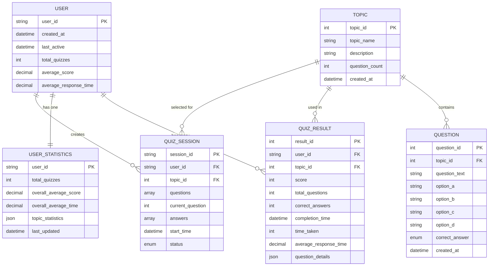
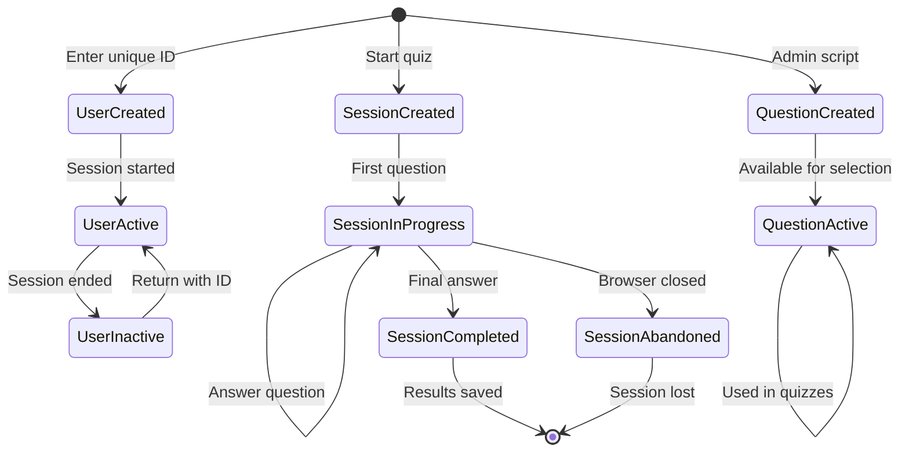

# Domain Model

## Overview
This document defines the core business entities, their attributes, relationships, and business rules for the quiz application domain.

## Core Domain Entities

### 1. User Entity

**Purpose**: Represents a quiz application user identified by unique ID

**Attributes**:
- `user_id` (String, Primary Key): Unique alphanumeric identifier
- `created_at` (DateTime): When user first accessed the system
- `last_active` (DateTime): Last activity timestamp
- `total_quizzes` (Integer): Total number of quizzes completed
- `average_score` (Decimal): Overall average score across all quizzes
- `average_response_time` (Decimal): Average time taken to answer questions

**Business Rules**:
- User ID must be alphanumeric only
- User ID must be unique across the system
- User ID is required for all system access
- No persistent authentication beyond session
- User data persists across sessions but ID must be re-entered

**Lifecycle**:
1. **Created**: When unique user ID is first validated
2. **Active**: During quiz sessions and dashboard access
3. **Inactive**: When session expires or user leaves
4. **Persistent**: User data remains in system indefinitely

### 2. Topic Entity

**Purpose**: Represents quiz subject categories

**Attributes**:
- `topic_id` (Integer, Primary Key): Unique topic identifier
- `topic_name` (String): Display name (General Knowledge, Science, Films)
- `description` (String): Topic description
- `question_count` (Integer): Number of questions available
- `created_at` (DateTime): Topic creation timestamp

**Business Rules**:
- Each topic must have at least 100 questions
- Topic names are predefined and managed by administrators
- Topics cannot be deleted if questions exist
- All topics are available to all users

**Lifecycle**:
1. **Created**: During initial system setup
2. **Active**: Available for quiz selection
3. **Maintained**: Questions added/updated by administrators

### 3. Question Entity

**Purpose**: Represents individual quiz questions with multiple choice answers

**Attributes**:
- `question_id` (Integer, Primary Key): Unique question identifier
- `topic_id` (Integer, Foreign Key): Reference to topic
- `question_text` (String): The question content
- `option_a` (String): First answer choice
- `option_b` (String): Second answer choice
- `option_c` (String): Third answer choice
- `option_d` (String): Fourth answer choice
- `correct_answer` (Enum: A|B|C|D): Correct answer identifier
- `created_at` (DateTime): Question creation timestamp

**Business Rules**:
- Each question must have exactly 4 answer options
- Each question must have exactly 1 correct answer
- Questions are text-based only (no multimedia in Phase 1)
- All questions within a topic have equal difficulty
- Questions must be associated with a valid topic

**Lifecycle**:
1. **Created**: During question bank setup
2. **Active**: Available for random selection
3. **Maintained**: Can be updated by administrators

### 4. Quiz Session Entity

**Purpose**: Represents an active or completed quiz session

**Attributes**:
- `session_id` (String, Primary Key): Unique session identifier
- `user_id` (String, Foreign Key): Reference to user
- `topic_id` (Integer, Foreign Key): Reference to selected topic
- `questions` (Array): List of selected question IDs
- `current_question` (Integer): Current question index (0-9)
- `answers` (Array): User's selected answers
- `start_time` (DateTime): Quiz start timestamp
- `status` (Enum): IN_PROGRESS | COMPLETED | ABANDONED

**Business Rules**:
- Each quiz contains exactly 10 questions
- Questions are randomly selected from chosen topic
- No duplicate questions within a session
- Sessions are not persisted if browser is closed
- Only one active session per user at a time

**Lifecycle**:
1. **Created**: When user starts a quiz
2. **In Progress**: During question answering
3. **Completed**: When all 10 questions answered
4. **Abandoned**: If session is terminated early
5. **Destroyed**: Session data cleared after completion

### 5. Quiz Result Entity

**Purpose**: Represents completed quiz results and scoring

**Attributes**:
- `result_id` (Integer, Primary Key): Unique result identifier
- `user_id` (String, Foreign Key): Reference to user
- `topic_id` (Integer, Foreign Key): Reference to topic
- `score` (Integer): Final score (0-10)
- `total_questions` (Integer): Always 10
- `correct_answers` (Integer): Number of correct answers
- `completion_time` (DateTime): When quiz was completed
- `time_taken` (Integer): Total time in seconds
- `average_response_time` (Decimal): Average time per question
- `question_details` (JSON): Question IDs, user answers, correct answers

**Business Rules**:
- Score equals number of correct answers
- Maximum score is 10 points
- Results are stored permanently
- Only last 5 results per user are displayed on dashboard
- All results contribute to user statistics

**Lifecycle**:
1. **Created**: When quiz session is completed
2. **Stored**: Persisted in database
3. **Aggregated**: Contributes to user statistics
4. **Displayed**: Shown in dashboard and results page

### 6. User Statistics Entity

**Purpose**: Aggregated performance metrics for users

**Attributes**:
- `user_id` (String, Primary Key): Reference to user
- `total_quizzes` (Integer): Total completed quizzes
- `overall_average_score` (Decimal): Average across all quizzes
- `overall_average_time` (Decimal): Average response time
- `topic_statistics` (JSON): Performance breakdown by topic
- `last_updated` (DateTime): Last statistics calculation

**Business Rules**:
- Statistics are calculated after each quiz completion
- Averages include all historical quiz results
- Topic statistics show performance per topic
- Statistics are updated in real-time

**Lifecycle**:
1. **Created**: After user's first quiz completion
2. **Updated**: After each subsequent quiz
3. **Maintained**: Continuously reflects current performance

## Entity Relationships

### User → Quiz Results (One-to-Many)
- One user can have multiple quiz results
- Each result belongs to exactly one user
- Relationship maintained through `user_id` foreign key

### Topic → Questions (One-to-Many)
- One topic contains many questions (minimum 100)
- Each question belongs to exactly one topic
- Relationship maintained through `topic_id` foreign key

### Topic → Quiz Results (One-to-Many)
- One topic can be used in multiple quiz results
- Each result is for exactly one topic
- Relationship maintained through `topic_id` foreign key

### User → User Statistics (One-to-One)
- Each user has exactly one statistics record
- Statistics record belongs to exactly one user
- Relationship maintained through `user_id` primary/foreign key

### Quiz Session → Questions (Many-to-Many)
- One session contains multiple questions (exactly 10)
- One question can appear in multiple sessions
- Relationship maintained through question ID array in session

## Domain Model Diagram



### Entity Lifecycle Diagram



## Business Rules and Constraints

### User Management Rules
1. User IDs must be unique across the entire system
2. User IDs must contain only alphanumeric characters
3. Users must re-enter ID for each browser session
4. No user registration or password required

### Quiz Rules
1. Each quiz must contain exactly 10 questions
2. Questions must be randomly selected from chosen topic
3. No duplicate questions within a single quiz
4. Each question has exactly 20 seconds for answering
5. Unanswered questions (timer expired) are marked incorrect
6. Users can only move forward through questions

### Scoring Rules
1. Each correct answer awards exactly 1 point
2. Incorrect or unanswered questions award 0 points
3. Maximum possible score per quiz is 10 points
4. Scores are calculated server-side for validation

### Data Persistence Rules
1. Quiz sessions are not saved if browser is closed
2. Quiz results are stored permanently
3. User statistics are updated after each quiz completion
4. Only last 5 quiz results are displayed on dashboard
5. All historical results contribute to average calculations

### Question Bank Rules
1. Each topic must have minimum 100 questions
2. Questions are text-based only (Phase 1)
3. All questions have equal difficulty within topic
4. Answer choices are randomized for each presentation

## Data Validation Rules

### User ID Validation
- Format: Alphanumeric characters only
- Length: Minimum 3, Maximum 20 characters
- Uniqueness: Must not exist in system
- Required: Cannot be empty or null

### Quiz Answer Validation
- Format: Must be one of A, B, C, D
- Required: Must select an answer (or timeout)
- Single Selection: Only one answer per question

### Score Validation
- Range: 0 to 10 inclusive
- Type: Integer only
- Calculation: Must equal count of correct answers

## Entity State Transitions

### Quiz Session States
```
CREATED → IN_PROGRESS → COMPLETED
    ↓
ABANDONED (if browser closed)
```

### User States
```
NEW → ACTIVE → INACTIVE
  ↓      ↓
CREATED → RETURNING
```

### Question States
```
CREATED → ACTIVE → (MAINTAINED)
```

## Performance Considerations

### Database Indexes
- Primary keys on all entities
- Index on `user_id` in Quiz Results table
- Index on `topic_id` in Questions table
- Index on `completion_time` for recent results queries

### Query Optimization
- Limit queries for dashboard to last 5 results
- Use aggregated statistics table for performance metrics
- Implement efficient random question selection

### Data Archiving
- Consider archiving old quiz results (future enhancement)
- Maintain statistics table for quick access
- Optimize for read-heavy workload (dashboard queries)

## Security Considerations

### Data Protection
- User IDs are not sensitive personal information
- Quiz answers are validated server-side
- No sensitive data exposed to client
- Input validation prevents injection attacks

### Access Control
- Session-based access control
- No data access without valid session
- User can only access their own data
